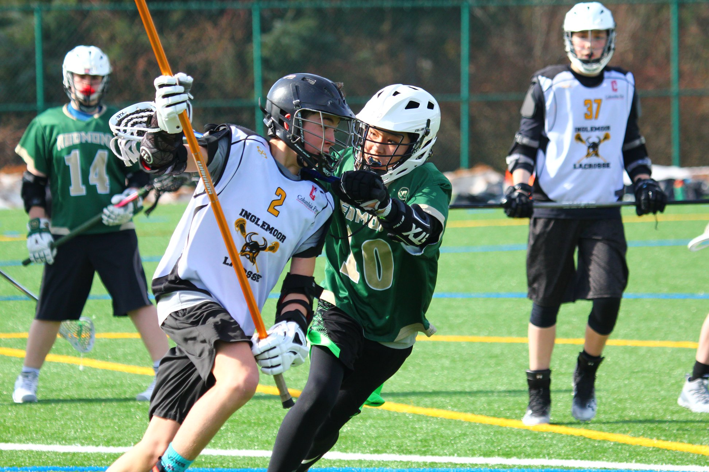

## My Start
I first began playing lacrosse in eighth grade. It was new for me, as it was the first real contact sport I had ever played. When I began the season, I was very reserved and passive, but by the end of the season, I had learned to play more aggressively.

## High School
Throughout the fall of my freshman year, I played in indoor games with my team, and became accustomed to high school lacrosse, which was much more physical than middle school lacrosse.
I am young for my grade, so even when playing in 8th grade I wasn't one of the biggest kids on the team.
High school really exaggerated the size difference, with players ranging from kids (like me) to fully grown adults.
As a result, I decided that I needed to bulk up to compete with the larger high schoolers, so I began to lift weights. Unfortunately, when the season was just about to begin, my school district was shut down due to COVID-19, and the lacrosse season was cancelled.

## Sophomore Season
My sophomore season didn't start until April due to COVID-19 restrictions, but our team still practiced through the fall and winter. 
When school returned to in-person learning, the shortened lacrosse season began, and we had a condensed schedule with daily practices or games.
I played on Junior Varsity throughout the season, but I got to play on the Varsity team for a few games, which was a very different experience.
It was during this season that I got my first high school goals and assists.

Here is a picture of me in uniform:
